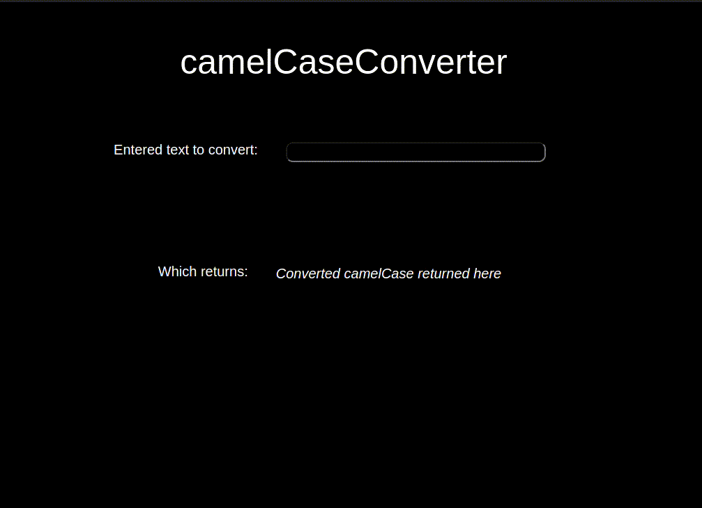

# Camel Case Converter



## Summary

**Hosted:** [Camel Case Converter](https://blurryq.github.io/camel-case-converter/)

A camel case converter designed to transform camel case strings from various Excel headings into a more readable format. Built to streamline the process of cleaning up large data sets, it helps convert complex database outputs into user-friendly documentation or reports.

## Features

This Camel Case Converter project showcases my knowledge of HTML, CSS, and JavaScript and includes:

- **Real-time Conversion**: Users can enter a string in the input field, and the converted camel case string is displayed instantly after submission.
- **Camel Case Recognition**: The converter detects camel case and splits it appropriately by adding spaces between uppercase letters for better readability.
- **Customizable Input Handling**: Handles different inputs, including non-alphabetical characters, ensuring that only valid characters are processed.
- **Interactive UI**: A clean and responsive layout using flexible CSS properties to ensure usability across devices and screen sizes.
- **ID Handling**: Special logic to preserve and properly format any "ID" occurrences within camel case strings, preventing it from being split or altered incorrectly.

## Setup

To get started with this project, follow the steps below:

### 1. Fork the Repository

First, you need to fork this repository to your GitHub account by clicking the "Fork" button near the top right of this page. If you are unfamiliar with this process, please follow this GitHub [guide](https://docs.github.com/en/pull-requests/collaborating-with-pull-requests/working-with-forks/fork-a-repo).

### 2. Clone the Repository

Next, clone the repository to your local machine using the following command. Make sure to replace `your-username` with your GitHub username:

```
git clone https://github.com/your-username/camel-case-converter
```

### 3. Running the File

Once cloned, navigate to your project folder, locate the HTML file, and double-click it. This should open the file in your default browser.

Alternatively, if you're using Visual Studio Code, you can install the "Live Server" extension and use it to launch the project by right-clicking on the HTML file and selecting **Open with Live Server**.

## Challenges

This project required me to solve several challenges, improving my skills in handling dynamic user input and string manipulation. Key challenges included:

- **Camel Case Detection and Formatting**: Splitting camel case strings properly while handling edge cases like "ID" in the input required thoughtful string manipulation techniques.
- **Handling Unusable Characters**: Filtering out unwanted characters while maintaining the integrity of the camel case string, ensuring that the final output only contains usable text.
- **Dynamic Display Update**: Updating the displayed result in real-time as the user types in the input field, involving DOM manipulation and input event handling.
- **Preserving "ID" in Strings**: Dealing with the special case of "ID" within camel case and ensuring it was not split, required careful logic for string processing.
- **Responsive Layout**: Creating a user-friendly interface that works seamlessly across different screen sizes, which involved using flexible CSS properties for layout and design.